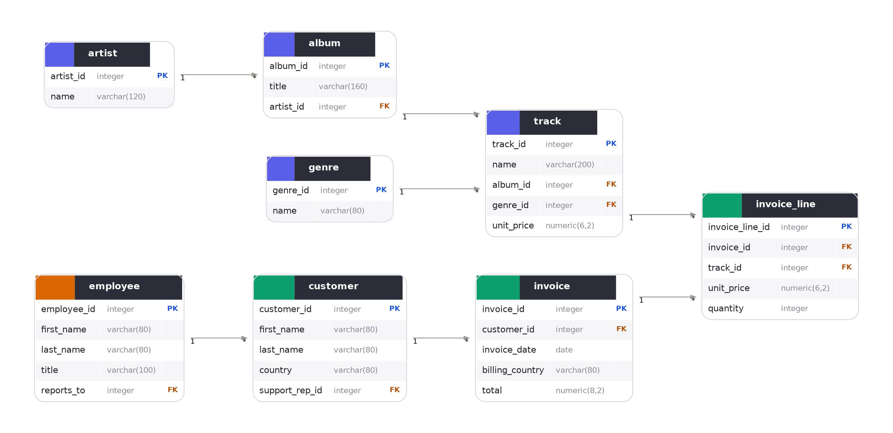

<div align="center">

# 🎵 Music Store Data Analysis Using SQL

**Uncovering sales, customer, and music trends from a digital music store database — one query at a time.**


</div>

---

## 📌 Overview

This project dives into a **digital music store database** using SQL to answer real-world business questions — the kind an analyst might be asked to solve for a growing e-commerce or media company. Using **PostgreSQL** and **pgAdmin**, I wrote queries ranging from simple lookups to multi-step analytical logic involving window functions, CTEs, and aggregations.

> 🎯 The goal: turn raw transactional data into insights a business could actually act on.

---

## 🗂️ Database Schema

The database models a music store with the following core tables:

| Table | Description |
|---|---|
| `customer` | Customer details and contact info |
| `invoice` | Purchase transactions |
| `invoice_line` | Line items per invoice |
| `track` | Individual songs/tracks |
| `album` | Albums linked to artists |
| `artist` | Artist details |
| `genre` | Music genre classification |
| `employee` | Staff who support customers |

<details>
   



</details>

---

## ❓ Business Questions & Insights

Queries are organized by difficulty in [`queries.sql`](./queries.sql):

### 🟢 Easy

 Q1  Who is the senior-most employee based on job title? 
 
         SELECT title, last_name, first_name 
         FROM employee
         ORDER BY levels DESC
         LIMIT 1

 Q2 Which countries have the most invoices? 

      SELECT COUNT(*) AS c, billing_country 
      FROM invoice
      GROUP BY billing_country
      ORDER BY c DESC


### 🟡 Moderate

### 🔴 Advanced
*(Add your advanced questions here, e.g. customers who spent the most per genre, using CTEs/window functions)*

> 💡 **Tip:** Once you've run all your queries, replace this section with your actual key findings — e.g. *"Rock is the top-selling genre, generating 35% of total revenue."*

---

## 🛠️ Tools & Tech

- **Database:** PostgreSQL
- **Client:** pgAdmin 4
- **Concepts used:** Joins, Aggregations, Subqueries, CTEs, Window Functions, GROUP BY / HAVING

---

## 📂 Repository Structure

```
Music-Store-SQL-Analysis/
├── Schema.sql        # Database schema (table structure)
├── queries.sql        # All business-question SQL queries
├── results/            # Query output screenshots / CSVs (optional)
└── README.md          # You're here!
```

---

## 🚀 How to Run This Project

1. **Clone the repository**
   ```bash
   git clone https://github.com/priyankaP7pandey/Music-Store-SQL-Analysis.git
   ```
2. **Set up the database** — create a new PostgreSQL database and run:
   ```bash
   psql -U your_username -d your_database -f Schema.sql
   ```
3. **Run the queries** — open `queries.sql` in pgAdmin's Query Tool and execute the queries you're interested in.

---

## 🙌 Acknowledgements

This project was inspired by the excellent tutorial by **[Rishabh Mishra](https://www.youtube.com/@RishabhMishraOfficial)** — [watch it here](https://youtu.be/VFIuIjswMKM) 🎥

---

## 📬 Connect

If you found this project useful or have suggestions, feel free to open an issue or connect with me!

<div align="center">

⭐ **If you like this project, consider giving it a star!** ⭐

</div>
